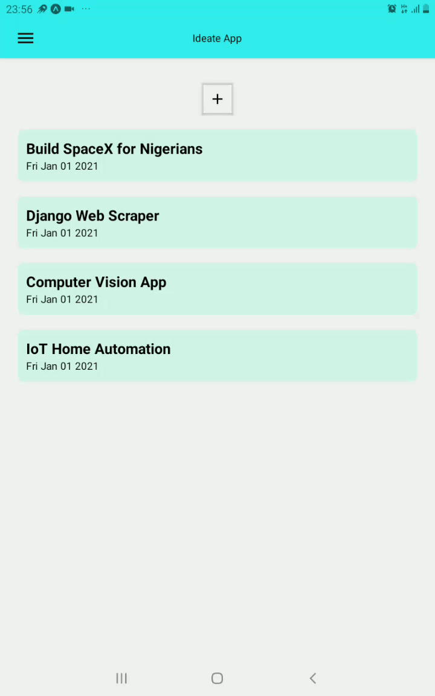

## Capstone basic project with React native 

**IDEATE** - A Note-taking app for ideas.

## Tools used 
- React-native 
- Expo

## What I learnt while building this ?
- React native components (View, Text, Touchable components, StyleSheet, Button, Alerts)
- React navigation (Stack and Drawer)
- Using React-native icons (i.e. Material icons)
- Structuring React-native projects better 
- Building custom components 
- Better styling using Flexbox 
- Better forms using Formik and Yup for validation

## Running the application 

- Install Expo (if you don't have it yet)

```
$ npm install -g expo-cli or yarn global add expo-cli
```

- Clone the repo

- Start the app 
```
$ cd ideate 
```
```
$ npm install 
```
```
$ expo start
```

## Testing the app

This is a gif showing how it works on my Android tablet

